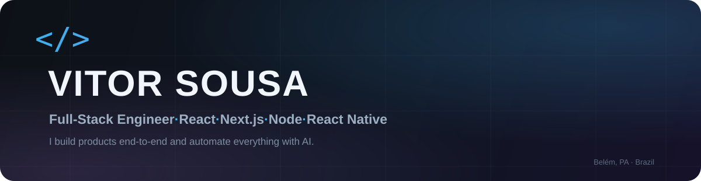

  

  
  
  

  
  
  

## What I do

I am a **full-stack engineer** focused on building reliable web and mobile applications, backend services and AI-powered automations. I work across the entire development cycle: understanding requirements, designing the solution, implementing interfaces and APIs, modeling data, writing automated tests and deploying to production.

- **Web applications:** responsive, accessible and maintainable interfaces with React, Next.js and TypeScript.
- **Backend services:** REST APIs, authentication, integrations, background jobs and business rules with Node.js and Python.
- **Mobile applications:** cross-platform apps with React Native and Expo.
- **AI and automation:** LLM integrations, structured outputs, provider abstraction, agents and automated workflows.
- **Data and infrastructure:** relational databases, caching, object storage, containers, CI/CD and cloud deployments.
- **Software quality:** type-safe contracts, automated tests, validation, observability and production-oriented error handling.

## Core stack

  

### Languages

### Frontend & mobile

React · Next.js · Vite · React Native · Expo · Tailwind CSS · shadcn/ui · Radix UI · TanStack Query · React Hook Form · Recharts

### Backend & APIs

Node.js · Fastify · NestJS · Express · FastAPI · REST APIs · Zod · JWT · OAuth 2.0 · background processing

### Databases & data processing

PostgreSQL · PostGIS · Drizzle ORM · Supabase · Redis · SQLite · pg-boss · pgvector

### AI & automation

OpenAI SDK · Google Gemini · structured outputs · Zod validation · pluggable LLM providers · MCP · agents · workflow automation · AI-assisted development

### Cloud, DevOps & integrations

Docker · AWS S3 · Cloudflare R2 · Vercel · Railway · GitHub Actions · EAS Build · Stripe · Resend · Sentry · pnpm workspaces

### Testing & quality

Vitest · Jest · supertest · Playwright · pytest · E2E tests · smoke tests · ESLint · strict TypeScript

### Low-code & workflow automation

Bubble.io · BuildPrint.ai · data modeling · workflow automation · API integrations

## How I work

1. **End-to-end ownership:** I move from requirements and architecture to implementation, testing and deployment.
2. **Clear contracts:** schemas, validation and type safety keep interfaces and services predictable.
3. **Resilience by design:** external integrations, background jobs and AI calls receive safe error handling and fallbacks.
4. **Automation where it matters:** I remove repetitive operational work without adding unnecessary complexity.
5. **Quality before release:** automated tests and production checks are part of the delivery process.

## Contact

  <a href="mailto:vitorfilho010@gmail.com"><strong>Email</strong></a>
  &nbsp;·&nbsp;
  <a href="https://www.linkedin.com/in/vitorsousa-53a078274"><strong>LinkedIn</strong></a>
  &nbsp;·&nbsp;
  <a href="https://wa.me/5591984299832"><strong>WhatsApp</strong></a>

